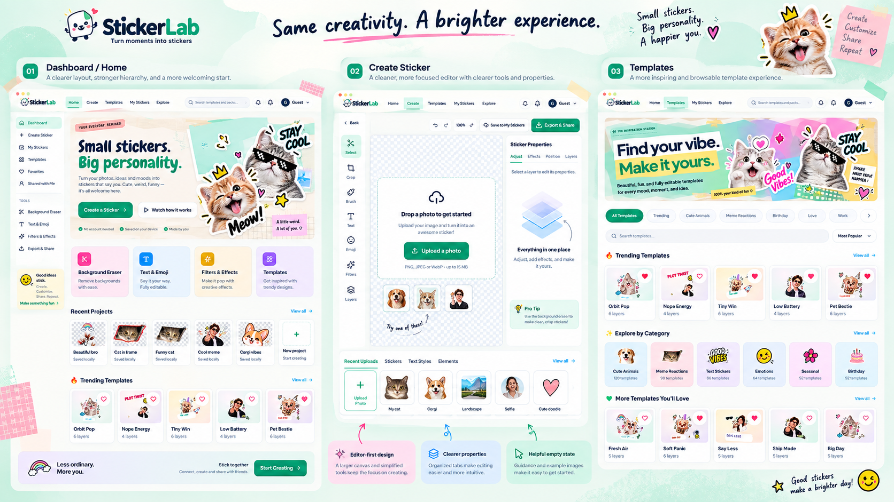

# StickerLab

Mint-green local sticker editor. Create a sticker, upload a photo, edit, save, reopen, and export a transparent PNG — no cloud credentials required.

The [university presentations implementation plan](docs/slides-implementation-plan.md) is in progress, with [architecture](docs/slides-architecture.md) and an admin dashboard design concept. The current app can create, list, reopen, and preview local 16:9 presentations; text/image editing, presentation export, templates, and catalog administration remain planned increments.



## Design previews

The supplied design mockups below show StickerLab’s visual direction—not screenshots of the current app. Sample accounts, statistics, subscription offers, and integrations are illustrative; see [Milestone status](#milestone-status) for implemented features.

### Dashboard

Start a sticker and browse recent projects and templates.


### Create editor

Compose photo stickers with a central canvas, editing tools, properties panel, and asset tray.


### Templates

Browse sticker designs by category and find a starting point to customize.


### My Sticker Packs

Organize stickers into packs and review their contents before export.


## Run

```bash
npm install
npm run dev
npm run typecheck
npm run lint
npm test
npm run test:browser
npm run build
```

Playwright uses Chromium at `/usr/bin/chromium` via `playwright.config.ts`. Firefox/WebKit are attempted only when those browsers are already available; this project does not download extra browser builds.

## Draft saving

`src/features/editor/draftSaving.ts` owns manual saves, the 800 ms autosave debounce, and flushing before project or workspace replacement. It finishes pending edits, captures the document and referenced blobs before queuing a write, and reports whether replacement is safe. Captured writes keep their originating repository; older saves cannot clear newer revisions. `useDraftAutosave.ts` connects this module to browser lifecycle events.

Project and workspace replacement wait for a safe flush. Leaving for Home starts saving without blocking navigation; failed work remains in memory. Page-hide saving is best effort, with an unload warning while work is pending. PNG export and cloud synchronization retain their existing behavior.

## Editor tools

- **Tool entry:** sidebar TOOLS, dashboard shortcuts, and mobile navigation for Background Eraser, Text & Emoji, Filters & Effects, and Export & Share open the existing editor with that tool active (`/create?tool=` or `/editor/:id?tool=`). They never mint a blank sticker on top of open work. If a document is required and saved stickers exist, a responsive gallery shows real artwork previews, project titles, and layer counts so you can choose create or reopen. Create a Sticker still starts a new document. Automatic background removal is not available.
- **Canvas:** the checkerboard fills the entire workspace. Export bounds follow the outermost visible artwork—including masks, transformed layers, and outlines—not the viewport or an export square. PNGs preserve aspect ratio with a longest edge up to 512px or 1024px; pack ZIPs use up to 512px. Fully transparent margins are trimmed. Reset view never changes the composition.
- **Fonts:** Fredoka, Baloo 2, Luckiest Guy, Chewy, Pacifico, and Bangers, alongside the existing fonts. Choose a family in Sticker Properties or insert one of six editable presets from **Text styles**.
- **Photo templates:** 12 layered compositions with distinct layouts (orbit, big type, polaroid, speech bubble, stamp, and others), including Orbit Pop, Nope Energy, and Pet Bestie. Stand-in photos are the six user-supplied Sep 8 cutouts (cat, corgi, people, boba). Each has a replaceable photo, editable caption, and separate decorations. Select Layers → Your photo → Adjust → Replace photo; the replacement fits without stretching and retains the layout/effects. Undo restores the original crop and erasure. The eight illustrations can appear as template decorations and remain available in the sticker tray.
- **Cute cutouts:** 39 cats, people, drinks, hearts, stars, space illustrations, and other decorations in **Stickers & decorations**. Add them as independent image layers; resize, rotate, flip, erase/restore, and apply outlines or filters. Image quarter-turns preserve the visible image center, including crops and flips.
- **Save and export:** font choices, text styles, and inserted image blobs survive reopening. The canvas measures text after fonts load; PNG/ZIP exports await the required fonts and report failures instead of silently substituting a bundled font.

Fonts and cutouts are served locally, with no extra credentials or dependencies. Font licenses and source-art limitations are listed in [asset provenance](docs/assets-provenance.md). Cutout lettering is part of the image; use a text preset when you want editable words. Large upscales can soften the modest-resolution sample artwork.

## Milestone status

- [x] React, strict TypeScript, Vite, React Router, Tailwind, and shadcn/ui-adapted Radix components (provenance in `docs/shadcn-provenance.md`)
- [x] Responsive Dashboard (`/`), editor (`/create`, `/editor/:projectId`), Templates (`/templates`), and My Sticker Packs (`/my-stickers`)
- [x] Versioned serializable `ProjectDocument` in `src/types/domain.ts` (1024×1024 transparent artboard)
- [x] IndexedDB repository (`getLocalRepository`) with atomic `saveProjectWithAssets`
- [x] Validated PNG/JPEG/static WebP upload (15 MB, 25 MP); original blob stored separately
- [x] Konva canvas: move, resize, rotate; DOM text editing; zoom/pan are view-only
- [x] Zustand commands, bounded undo, one history entry per completed drag/slider/text gesture
- [x] Manual save and debounced autosave with Saving / Saved locally / Save failed
- [x] Reopen from Dashboard and My Stickers; assets and fonts rehydrate
- [x] Transparent PNG export cropped to visible artwork, with a longest edge up to 512px or 1024px (independent of viewport zoom/pan). Empty/fully erased artwork produces a recoverable export message.
- [x] Template cloning into independent editable projects, preview dialogs, and template favorites
- [x] Layer manager in editor: reorder, hide/show, lock/unlock, rename, duplicate, and delete with undo support
- [x] Local sticker pack management (create, duplicate, delete without deleting stickers, add/remove stickers, reorder)
- [x] Full pack ZIP export with numbered transparent PNGs and manifest.json
- [x] Image filters (brightness, contrast, saturation, grayscale) with reset, shared between canvas preview and PNG exports
- [x] Silhouette outlines & borders with customizable color and thickness on canvas and export
- [x] Scrapbook-style Templates banner with textured paper, yellow headline highlights, and layered user-supplied cat stickers; responsive HTML text rather than a screenshot
- [x] Packs scrapbook banner with torn pastel paper, taped illustrated polaroids, layered cats, and responsive New Pack / Import Photos controls; Playwright reference comparison documented in `docs/ui-audit.md`
- [x] Shared scrapbook header with torn-paper navigation, supplied StickerLab wordmark, taped search/account controls, and accessible tablet/mobile navigation; header search finds templates by name/category/tags and saved packs by name/description, with Ctrl/Cmd+K access and navigable results; notifications retain an honest unavailable notice
- [x] Sidebar, dashboard, and mobile tool shortcuts activate Background Eraser, Text & Emoji, Filters & Effects, and Export & Share on the existing editor without silently replacing open work. Choosing the same shortcut again re-applies that tool (for example reopening Export after closing it).
- [x] Manual alpha mask erase / restore in image-local coordinates with continuous strokes, crop clipping, matching cursor geometry, and undo/redo
- [x] Email magic-link sign-in UI, session restoration, and private cloud saving backed by Supabase Auth, PostgreSQL, and private Storage (live inbox delivery unverified until custom SMTP)
- [x] Local-first save/reopen, offline editing, retry queue across reload, and explicit guest collection import
- [x] Atomic compare-and-set concurrency revision checks with automatic conflict copies for stickers and packs
- [x] Local presentation library (`/presentations`), blank creation/reopen, recoverable load states, and a fixed 1280×720 slide preview with view-only fit/zoom/pan
- [ ] Presentation text/image editing, autosave, PDF/PPTX/backup UI, templates, and administrator catalog workflows
- [ ] Public/read-only cloud sharing and native WhatsApp/Telegram installation

Deferred actions open an explanation or stay disabled. They do not report success. Automatic background removal and public sharing are unavailable.

## Hosting

Production is a Vite static app on Vercel: [https://stickerlab-eta.vercel.app](https://stickerlab-eta.vercel.app). Client routes (`/templates`, `/editor/:id`, and so on) fall back to `index.html` via `vercel.json`. Cloud auth is optional; the site works fully locally in the browser without `VITE_SUPABASE_*` keys.

```bash
npx vercel --prod
```

GitHub Actions (`.github/workflows/ci.yml`) runs typecheck, lint, unit tests, and the production build on pushes and pull requests to `main`. Vercel deploys production from `main` on `ducchinhpro123/Peeloodle`.

## Cloud configuration

StickerLab operates fully local-only when cloud configuration is absent. To enable private cloud saving:

1. Copy `.env.example` to `.env.local` and provide your project's URL and publishable key (`sb_publishable_...` or legacy `anon` key; never service-role secrets):
   ```bash
   cp .env.example .env.local
   ```
2. In Supabase Dashboard → Authentication → URL Configuration, set your Site URL and add each authorized redirect origin (e.g. `http://localhost:5173/auth/callback`, `http://127.0.0.1:4173/auth/callback`). Set matching comma-separated origins in `VITE_AUTH_ALLOWED_ORIGINS`.
3. Migrations in `supabase/migrations/` apply the PostgreSQL schema, JSON schema document validators, owner-based RLS policies, private bucket configuration, and transactional `commit_sticker_resource` RPC.
4. Default Supabase SMTP allows only authorized team members and has a 2/hour rate limit. For production delivery to any address, configure custom SMTP in Supabase Auth settings. Magic-link *request*, invalid/expired callback UI, and synthetic-session journeys are covered; a live inbox round-trip is not verified on the default SMTP service. The owner checklist (Vercel variables, redirects, SMTP, magic-link gate) is [docs/production-release.md](docs/production-release.md).
5. Image/mask bytes upload to private Storage at `ownerId/sha256` and are verified before `commit_sticker_resource` publishes database rows. PostgreSQL and Storage are not one transaction: a failed RPC can leave unused objects. They are never public, never referenced by a committed project, and retries reuse the same hash (HTTP 409). This milestone does not delete orphans; add a bounded owner-scoped sweeper if storage quota matters.
6. Verification suite for real cloud authorization (ordinary user clients, not service-role):
   ```bash
   node --env-file=.env.cloud-test scripts/verify-cloud.mjs
   npm run test:cloud
   ```
   `test:cloud` loads dedicated credentials only into the test process, derives the public Vite variables for that process, and starts a separate cloud-enabled server on `127.0.0.1:4174` with server reuse disabled. It fails before Playwright starts when a dedicated test variable is missing. Ordinary local development, CI, and `npm run test:browser` remain local-only and do not require cloud secrets.

## Design mapping

The four supplied images are inspiration, not a pixel-for-pixel target. The current UI uses original layered cat-sticker collages, playful copy, pastel cards, and a calmer editor workspace. Shared tokens in `src/styles.css` define the spacing rhythm, navy `#08152f`, primary emerald `#00875e`, near-white `#fafbf8`, and mint `#ddf7ed`. Plus Jakarta Sans is bundled locally (OFL).

Dialogs share typography, fields, footers, 44px close controls, and scroll containment; pack deletion uses the same confirmation style. Pack details remain available on tablet/mobile. See [UI audit](docs/ui-audit.md) for findings and [asset provenance](docs/assets-provenance.md) for supplied artwork and licensing limitations.

## Verification

`src/features/editor/commands.test.ts` covers undo/gesture history, rotated flips, and runtime asset retention. `src/features/exports/renderDocument.test.ts` covers PNG size/transparency, multiline text, and ImageBitmap cleanup. `src/features/editor/editor.test.tsx` covers upload → text → save → reopen, leave-before-debounce flush, snapshot saves, stale upload discard, and slider/typing-safe shortcuts. `src/features/assets/validateUpload.test.ts` rejects APNG and mislabeled BMP. `src/features/exports/zipExport.test.ts` covers ZIP binary generation and pack manifest bundling. `src/features/editor/maskUtils.test.ts` covers inverse transform mapping, singular transforms, and inverse-scaled brush radii. Actual brush rasterization is checked in Chromium rather than mocked canvas calls. `npm run test:browser` starts from the Dashboard CTA, edits the canvas, reloads multiline text, inspects downloaded 512 and 1024 PNG dimensions, alpha, and composition, clones templates, creates/exports sticker pack ZIPs, and tests the manual erase/restore brush workflow with transparent hole verification.

`e2e/render-parity.spec.ts` uploads a probe photo, applies brightness/contrast/saturation/grayscale, silhouette outline, rotation, and flip through the live inspector, then compares the on-canvas artwork to a downloaded 1024px PNG. A catalog cutout export is decoded for ink and transparency. Image-local compositing is cached independently of transforms. ZIP exports fail explicitly if any member cannot load or render, rather than silently downloading incomplete packs. Pack/template write failures remain visible and recoverable; pack deletion requires confirmation and preserves stickers. Favorite template cards stay synchronized across rails.

`e2e/mask-regressions.spec.ts` covers successive strokes, no-op/redo preservation, non-uniform scale, crop clipping, rotation/flips with zoom/pan, original-alpha restoration, cancellation/secondary pointers, corrupt masks, encoding failures and retries, save/export/navigation races, and touch erase/restore at 390×844. It compares real masked preview/PNG pixels and every decoded pixel of the corresponding pack ZIP image. Save/export await pending strokes; the active editor warns before unloading unsaved work. Masks and assets remain atomically saved with the document in the existing IndexedDB v3 schema; no new migration is required.

Brush movement updates only the active raster and DOM cursor, with no React commits, document revisions, or PNG encoding during pointer movement. Preview rasters are capped at 1024px (high zoom may look softer); mask data and exports remain full-resolution. On this Linux x86_64 machine, headless Chromium 151 at 1440×900, one photo plus 29 shape layers, and 30 synthetic pen moves: the 2048px photo's median frame interval fell from about 32ms to 16.7ms after bounding preview raster work. The final suite measured 16.6ms median / 17.3ms p95 frame intervals and 0.9ms p95 pointer-handler time for that case. These are local observations, not a universal 60 FPS guarantee; maximum-size 25MP photos and physical pen hardware were not profiled. Rerun `npx playwright test e2e/mask-regressions.spec.ts -g '30 layers' --workers=1` for measurements and JSON attachments.

Verification commands: `npm run typecheck`, `npm run lint`, `npm test`, `npm run build`, and `npm run test:browser -- --workers=2`. Lint retains the existing repository-provider Fast Refresh warning. Firefox/WebKit and physical devices are unverified.

`e2e/illustrated-templates.spec.ts` verifies all 12 previews against rendered document pixels, photo replacement, editable captions, undo/redo, independent copies, save/reopen, transparent PNGs, and failure recovery at desktop/tablet/mobile sizes. Regenerate previews after changing template definitions: start Vite on port 4173, then run `node scripts/generate-template-previews.mjs`.

`e2e/fonts-stickers.spec.ts` verifies all six font faces through the editor UI, downloaded PNG pixels after save/reopen, delayed and failed font loads, and cutout + text preset → rotate/outline → save/reopen → transparent PNG at desktop/tablet/mobile widths. These specs do not import the editor store; they drive the live document and inspect files. Run them against the production preview with `npx playwright test e2e/fonts-stickers.spec.ts e2e/render-parity.spec.ts --config playwright.preview.config.ts`.

`e2e/ui-polish.spec.ts` checks all four sticker routes and representative dialogs at 1440×900, 1024×768, and 390×844, plus a short 390×480 viewport. It covers image loading, overflow, keyboard focus trapping/restoration, mobile pack controls, and isolation of editor shortcuts from dialogs. Refresh screenshots are generated outside the repository at `/tmp/stickerlab-ui-audit/`; foundation screenshots remain at `/tmp/stickerlab-browser-verification/`. The `/presentations` route family has its own spec and committed captures: `e2e/presentations.spec.ts` with evidence in `proofs/out/p15-*` and `proofs/out/p16-*` (see `proofs/p15-p16-basic-presentations.md`).
