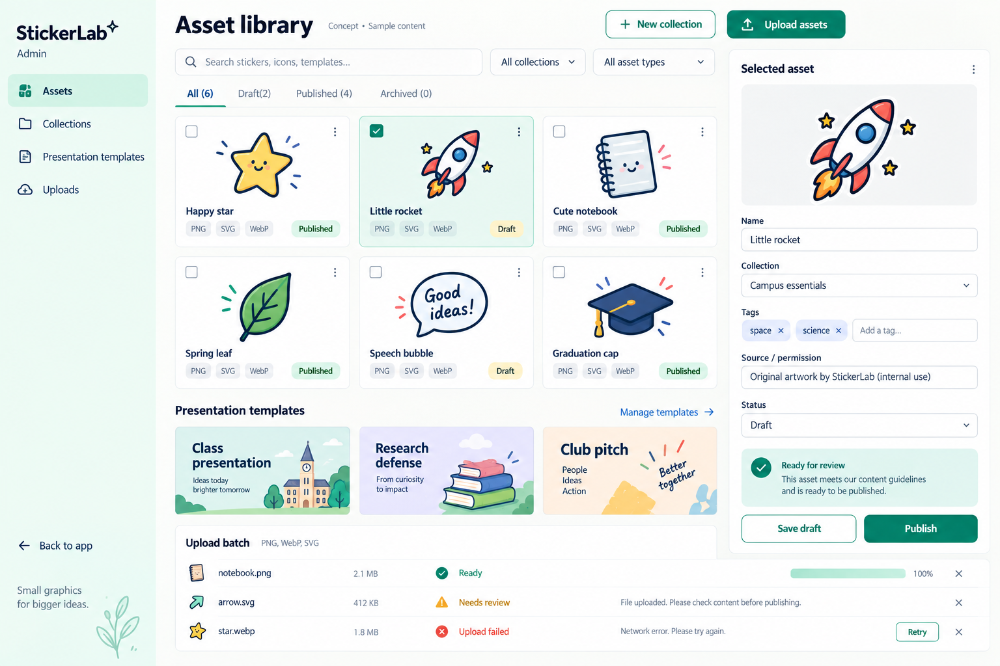

# University presentations: implementation plan

**Status:** scope confirmed by the owner on 2026-09-10. Milestone 0 (P01–P07) is implemented with
recorded evidence under `proofs/`; P08 is blocked pending an authorized preview deployment (see
`proofs/p08-deployment-blocked.md`). Milestone 1 foundation (P09–P14) is implemented with unit
contract tests (the IndexedDB adapter is recorded in `proofs/p13-p14-idb.md`); the presentation
library, blank creation/editor routes, fixed slide renderer (P15–P16) and basic wrapped text
editing (P17) are implemented and recorded in `proofs/p15-p16-basic-presentations.md` and
`proofs/p17-text-editing.md`. Personal image insertion (P18) and truthful save/autosave (P19) are
implemented and recorded in `proofs/p18-p19-image-and-save.md`, which includes browser pixel and
IndexedDB evidence plus the review-driven hardening that followed (atomic insertion, the 200 MB media
budget, conflict recovery and the guarded editor exit — with the unguarded browser Back/Forward
limitation stated there). P20 (library rename, duplicate, safe delete and real first-slide thumbnails) is
recorded in `proofs/p20-library-operations.md`, and P21 verified the full create → edit → save → reload →
reopen journey in `proofs/p21-milestone-journey.md`, which completes Milestone 1. Milestone 2 has started:
P22 (slide rail add/duplicate) and P23 (reorder/delete) are recorded in `proofs/p22-p23-slide-rail.md`, and
P24 (element move/resize/rotate) in `proofs/p24-element-transforms.md`. Review-driven
corrections are recorded in `proofs/correction-pass.md`. Start the next session from
[`HANDOFF.md`](../HANDOFF.md).

This plan is designed for one developer working in small increments. Product scope came from the [planning interview](slides-planning.md); technical contracts are in [the architecture](slides-architecture.md).

## Outcome and release boundary

A university student chooses a class, research-defense or club-pitch template (or starts blank), edits a 16:9 presentation with text, images, stickers and shapes, saves it locally, reopens it, downloads a portable editable backup, and exports PDF or editable PPTX. A single administrator manages the free asset and template catalog through a dashboard, including bulk PNG/WebP/SVG uploads.

The attraction is an accessible sticker/icon collection and useful university layouts. Demand remains untested. “Lots of templates” means three complete starter templates with 8–10 useful slide layouts each for this release, followed by real student feedback before expanding.

### Included

- Desktop/laptop editor, usable at 1440×900 and 1024×768; slide add/duplicate/reorder/delete, free placement, alignment guides and optional locking.
- Text wrapping, bullets, alignment, mixed bold/italic, hyperlinks, English/Vietnamese, a small tested font set, background color and theme defaults.
- Uploads, catalog images, personal sticker snapshots, basic shapes, layer order, undo/redo, local autosave/reopen and backup restore.
- PDF as fixed-visual pages; PPTX with editable text/shapes and individually movable pictures. SVG artwork is inserted/exported as a single image.
- Supabase-backed catalog with administrator-only mutation, draft/published/archived lifecycle, immutable versions and independent copies in student presentations.
- Admin-created templates use the same presentation editor. Bulk uploads handle hundreds of assets in bounded batches with per-file status/retry.

### Deferred

Student cloud presentation storage, automatic cross-device access, full phone editing, browser slideshow mode, speaker notes, native charts/tables/equations, video/audio/animation, PPTX/PDF import, AI generation, simultaneous editing, public sharing, payments and individual SVG-part editing. Students may use images of charts/equations and transfer exported files to phones themselves. A portable project backup is our own supported format, not arbitrary presentation import.

## Design reference



This generated reference is for the admin asset library; dedicated template screens are specified in [the architecture UI section](slides-architecture.md#ui-design-reference). Built-in imagegen was used; [exact prompt](design/admin-dashboard-prompt.txt). The screenshot is sample content, not implemented UI or approved artwork. Its format badges and publication-readiness wording need the corrections documented in the architecture.

## How to execute

Each row is a small work item with a concrete acceptance check. Dependencies are task IDs; finish them before starting the row. Every task starts unchecked. Where a task spans more than one comfortable coding session, split it by supported behavior while retaining its acceptance check—do not combine several milestones into one large change.

The table order is the recommended solo sequence. Early proofs resolve risks; subsequent milestones deliver working flows. No calendar estimates are promised. Use a short implementation PR per coherent task or closely related pair, including relevant verification. Tasks may later become GitHub Issues following `docs/agents/issue-tracker.md`; this planning session does not publish issues.

The first coding task is **P01**, then the **export/text proof P02–P05**. Do not begin with bulk template production or a complete admin dashboard.

## Milestone 0 — Prove the risky contracts

**Result:** concrete evidence that editable export, rich text and trusted image processing can support the chosen design. Temporary proof artifacts must be clearly separate from user-facing functionality.

| Done | ID | Work item | Depends on | Completion evidence |
| --- | --- | --- | --- | --- |
| [x] | P01 | Capture current scripts, routes and sticker regression baseline; identify existing user changes. | — | Record actual checks/failures; preserve the unrelated research file and existing stickers. |
| [x] | P02 | Create a tiny presentation fixture with English/Vietnamese, bold/italic runs, bullets, a link, a shape and a transparent image; define geometry conversions. | P01 | Fixture uses a document model; tests confirm document units → inches/points and slide order. |
| [x] | P03 | Evaluate PptxGenJS with that fixture; inspect PPTX XML/media and open it in an available presentation app. | P02 | Text/shape remain editable and image separately movable; record app/version and screenshots. No full-slide raster workaround. |
| [x] | P04 | Prove wrapped rich text with DOM editing and Konva rendering, including Vietnamese IME and paste. | P02 | Caret, formatting, wrapping and canvas output agree for the fixture; unsupported markup is normalized. |
| [x] | P05 | Choose and verify two font families; compare a difficult long-title/bullets export fixture. | P03, P04 | Glyph/weight coverage and provenance documented; no missing text/overflow in tested app. Note unavailable readers. |
| [x] | P06 | Prove PDF raster-page export and bounded ZIP backup/restore using the fixture. | P02 | Inspect PDF dimensions/order and backup contents; restore reproduces fixture data/media. |
| [x] | P07 | Prove Node processing of representative PNG/WebP/SVG with actual decode limits and a hostile SVG fixture. | P01 | Valid outputs look correct; animation/external resources/oversized inputs fail; measure CPU/memory. |
| [ ] | P08 | Verify native processing packaging in an authorized preview environment, direct-to-Storage upload and one-job invocation. | P07 | Deployment/runtime evidence; image bytes bypass function request body; configured limits recorded. No production publishing. |

**Gate:** resolve export/text failures before full editor work; resolve processing/deployment failures before admin ingestion. If evidence forces a library or deployment change, update the architecture and affected tasks instead of silently reducing the editable-PPTX promise.

## Milestone 1 — Create, save and reopen a basic presentation

**Result:** `/presentations` → blank presentation → edit text/image → save → reload → reopen, preserving existing sticker flows.

| Done | ID | Work item | Depends on | Completion evidence |
| --- | --- | --- | --- | --- |
| [x] | P09 | Define versioned presentation, slide, element, paragraph/run and asset contracts. | P02, P05 | Distinct from sticker document; IDs, geometry, fonts and media references explicit. |
| [x] | P10 | Implement parser/serializer and centralized size limits. | P09 | Reject unsupported versions, duplicate IDs, invalid geometry/runs and missing references; no partial mutation. |
| [x] | P11 | Add command store for slide and element mutations plus separate view state. | P10 | Commands mutate serializable data; selection/zoom/slide navigation do not dirty documents. |
| [x] | P12 | Add presentation repository interface and memory adapter. | P10 | Contract checks cover save/load/duplicate/remove and complete asset references. |
| [x] | P13 | Add IndexedDB stores through a safe additive upgrade; keep existing sticker data. | P12 | Upgrade a populated old DB fixture; reopen old stickers and new presentations. Use actual current DB version at implementation. |
| [x] | P14 | Add atomic presentation/media saves and revision checks. | P13 | Failed writes preserve prior save; concurrent tab stale writes cannot silently win. |
| [x] | P15 | Add presentation list, blank creation and editor routes using shared shell/components. | P11, P14 | Create and reopen from real local state; empty/long-title states usable. |
| [x] | P16 | Render one fixed 16:9 slide, background and selected elements; fit/zoom/pan. | P15 | View transforms never alter stored coordinates; page bounds remain fixed. |
| [x] | P17 | Add a basic wrapped text box using the proven text bridge and model. | P04, P05, P16 | Edit English/Vietnamese, blur/save/reopen without losing content or position. Save/reopen is proven through the repository contract in P17; the Save/autosave UI is P19. |
| [x] | P18 | Add personal PNG/JPEG/static WebP image upload and stored media insertion. | P14, P16 | Existing size/format validation reused where valid; failed upload leaves no broken layer. Verified in a real browser, including that the media bytes reach IndexedDB (`proofs/p18-p19-image-and-save.md`). Insertion is atomic (document + bytes in one repository transaction, decode only after the commit) and the 200 MB media budget is refused before any mutation, charged once per unique asset. |
| [x] | P19 | Add autosave and explicit Save with truthful state and edit/media flushing. | P17, P18 | Dirty → saving → saved locally; induced quota/write failure retains editable work. Failure and conflict paths are unit-tested with the memory adapter's injected write failure; the autosave path is browser-verified. A stale revision now has a recovery path ("Keep my copy" writes an independent copy, then reopens the newer revision), leaving the editor flushes and awaits the write, and one command landing during an insert write is no longer dropped. |
| [x] | P20 | Add thumbnails, rename, duplicate and safe delete in presentation library. | P19 | Duplicate independent; delete cancels safely and restores focus; sticker projects untouched. Verified in a real browser, every claim read back from IndexedDB, plus real first-slide thumbnails and containment at 1024×768 and 390×844 (`proofs/p20-library-operations.md`). |
| [x] | P21 | Verify the milestone's create/edit/save/reload/reopen browser journey. | P20 | Composition and media survive reload at desktop/tablet widths; inspect persisted output. Verified at 1440×900 and 1024×768 in one journey carrying text **and** media through autosave, a library rename, a page reload and a reopen, with the persisted row plus media bytes read back and hashed against the uploaded file, and pixel evidence that includes an empty-region control (`proofs/p21-milestone-journey.md`). |

## Milestone 2 — Make multi-slide editing useful

**Result:** students can assemble a complete presentation with reliable text, layout controls and history.

| Done | ID | Work item | Depends on | Completion evidence |
| --- | --- | --- | --- | --- |
| [x] | P22 | Add slide rail with selection and add/duplicate actions. | P21 | New IDs on duplicate; copied media remains valid; current slide clearly indicated. |
| [x] | P23 | Add slide reorder and delete with keyboard alternatives. | P22 | Ordering persists; deleting active slide selects a survivor; at least one slide remains. |
| [x] | P24 | Add element move/resize/rotate with document-coordinate transforms. | P16, P21 | Same document-space move at 100% and 125% zoom; the drawn frame/handles and the numeric inspector agree (≤1 px frame, ≤3 px handle); every visible kind selects; a locked element ignores a drag without panning; one gesture = one history entry (`proofs/p24-element-transforms.md`). |
| [ ] | P25 | Add meaningful undo/redo, gesture grouping and bounded media retention. | P23, P24 | One drag/slider/text session = one history entry; undo spans slides; removed media survives while history references it. |
| [ ] | P26 | Add mixed bold/italic selection, font size/color/family controls. | P17, P25 | Run formatting survives undo/save/reopen; IME typing does not trigger canvas shortcuts. |
| [ ] | P27 | Add bullets, paragraph alignment/spacing, links and visible text-overflow feedback. | P26 | Long English/Vietnamese paragraphs render correctly; unsafe links rejected; overflow is actionable. |
| [ ] | P28 | Add rectangle, rounded rectangle, ellipse, line and arrow. | P24, P25 | Fill/stroke/geometry persist and undo correctly; supported kinds match export adapter. |
| [ ] | P29 | Add image crop, replacement and flip with preserved aspect ratio. | P18, P25 | Replace preserves intended placement; crop data stays non-destructive; undo restores original. |
| [ ] | P30 | Add accessible element/layer list, order controls, duplication, delete and locks. | P25, P28, P29 | Keyboard can select/reorder/edit properties; locked elements ignore canvas drags. |
| [ ] | P31 | Add alignment guides, snapping and explicit alignment controls. | P24, P30 | Correct at multiple zoom levels; guides never enter saves/exports. |
| [ ] | P32 | Add slide backgrounds and copied document theme defaults. | P27, P28 | Changes do not alter another presentation/template; existing element styles remain predictable. |
| [ ] | P33 | Insert saved personal stickers as immutable image snapshots through existing compositor. | P18, P30 | Editing/deleting source sticker does not break presentation; original sticker remains editable. |
| [ ] | P34 | Verify multi-slide gestures, keyboard access, long content and delayed fonts. | P23–P33 | Focused tests and desktop/tablet browser evidence; no canvas shortcuts in dialogs/text input. |

## Milestone 3 — Ship trustworthy files and portable work

**Result:** an edited presentation reopens locally and exports usable PDF/PPTX plus a restorable backup.

| Done | ID | Work item | Depends on | Completion evidence |
| --- | --- | --- | --- | --- |
| [ ] | P35 | Create export snapshot/preflight service that awaits edits, fonts and media. | P19, P34 | Concurrent edit cannot mix revisions; missing assets/overflow yield clear actionable messages. |
| [ ] | P36 | Implement fixed-page slide renderer shared by previews and PDF rasterization. | P35 | Exact aspect/order/background, no artwork trim, viewport transform or handles. |
| [ ] | P37 | Implement ordered PDF generation and inspect actual pages. | P06, P36 | 16:9 page sizes and expected page count; visual content intact; image-based PDF limitation documented. |
| [ ] | P38 | Implement PPTX text paragraphs/runs, bullets and hyperlinks. | P03, P05, P35 | Native text objects preserve content/styles; edit downloaded text and save successfully. |
| [ ] | P39 | Implement PPTX shapes and image transforms/crops. | P28, P29, P38 | Shape stays editable; each image separately movable; transparency and placement preserved. |
| [ ] | P40 | Add lazy export loading, progress, cancellation boundaries and cleanup. | P37, P39 | Failures do not download partial files; repeated export releases URLs/canvases; main editor stays usable. |
| [ ] | P41 | Implement backup writer with schema manifest, hashes, media and font dependencies. | P06, P35 | Inspect archive; all required bytes/metadata present, no temporary URLs or unrelated documents. |
| [ ] | P42 | Implement bounded backup parser and safe restore to a new presentation. | P10, P14, P41 | Corrupt/oversized/duplicate-path/future-version archives fail without changing saved work. |
| [ ] | P43 | Add backup/restore UI and recovery guidance on save failure. | P40, P42 | Restore works in a fresh browser profile; student can download work after a local save failure. |
| [ ] | P44 | Verify full export compatibility fixture across available readers. | P37–P43 | Record app/version/OS, editability and screenshots; report untested apps, not universal support. |
| [ ] | P45 | Verify large-document limits and network-disabled local editing/export. | P44 | Sequential export stays within measured bounds; no catalog request needed for saved media. |

**Checkpoint:** this is the first complete student blank-presentation flow. It can be tried locally while the catalog/admin work proceeds. Do not call the full release complete until templates and administrator flows work.

## Milestone 4 — Establish catalog permissions and versioning

**Result:** a trusted catalog backend with verified admin authorization; no public publishing by ordinary users.

| Done | ID | Work item | Depends on | Completion evidence |
| --- | --- | --- | --- | --- |
| [ ] | P46 | Add catalog collection/item/version, template/version, job and event schema migrations. | P08, P10 | Fresh and upgrade migrations work; immutable version/dependency constraints tested. |
| [ ] | P47 | Add server-controlled admin membership and document bootstrap/recovery. | P46 | Ordinary user cannot self-promote via profile, API or SQL grants. No client service credentials. |
| [ ] | P48 | Add private source/derivative buckets and database/Storage policies. | P47 | Anonymous reads only approved published media; ordinary user cannot read drafts or private sticker uploads. |
| [ ] | P49 | Implement typed catalog read/admin repositories and paged filters. | P48 | Published-only public queries, stable cursors, real empty/error states; no fetching every full image. |
| [ ] | P50 | Implement guarded publish/archive RPCs with revision and dependency checks. | P49 | Failed publish keeps prior live version; archived items leave catalog; pinned template dependencies preserved. |
| [ ] | P51 | Add admin route/session guard and shared admin shell. | P47, P49 | Login return path works; unauthorized UI access rejected and direct backend calls independently denied. |
| [ ] | P52 | Add collection create/edit/order/archive UI. | P50, P51 | Metadata persists; cancel and revision conflict preserve work; collection archive handles contained items explicitly. |
| [ ] | P53 | Run live catalog isolation checks with anonymous, ordinary and admin clients in a test environment. | P48–P52 | Reads/writes signed URLs, role revocation and publish races checked; never use service-role to simulate an ordinary user. |

## Milestone 5 — Upload, review and publish the asset collection

**Result:** administrator can ingest hundreds of files in batches; students can use published assets without losing them after catalog changes.

| Done | ID | Work item | Depends on | Completion evidence |
| --- | --- | --- | --- | --- |
| [ ] | P54 | Add durable batch/job creation, reserved upload paths and direct Storage uploads. | P48, P53 | Restricted paths; resumable status after reload; failed file doesn't restart successful uploads. |
| [ ] | P55 | Add server job claims, leases, idempotent retries and conditional completion. | P54 | Duplicate requests don't duplicate versions; stale completion cannot overwrite a new attempt. |
| [ ] | P56 | Implement strict PNG/static WebP processing with metadata and derivatives. | P07, P55 | Full decode checks types, animation/bytes/pixels; outputs verified visually and by actual MIME/hash. |
| [ ] | P57 | Implement restricted SVG parsing and bounded rasterization. | P07, P55 | Reject scripts/external resources/entities/unsupported complexity; approved SVG matches preview and exports. |
| [ ] | P58 | Add bulk queue UI: selection, progress, per-file errors, retry and cancel/resume. | P56, P57 | 100-file mixed batch works; close/reopen reports queued work honestly; no fake background completion. |
| [ ] | P59 | Add asset grid, selection inspector, names/tags/provenance and draft preview. | P49, P58 | Search/filter with actual metadata; unsupported items cannot appear ready to publish. |
| [ ] | P60 | Connect individual publish/archive/update UI to immutable versions. | P50, P59 | Update doesn't mutate published bytes; archive and replacement show correct availability. |
| [ ] | P61 | Add bounded abandoned-upload cleanup and operation diagnostics. | P55, P60 | Dry-run shows only unreferenced objects; pinned/live media cannot be deleted. |
| [ ] | P62 | Add student catalog panel with collection/type/search and lazy previews. | P30, P49, P60 | Only published items; loading/error/empty/offline states and keyboard insertion work. |
| [ ] | P63 | Download/store a catalog snapshot before committing image insertion. | P14, P62 | Media download failure leaves document intact; catalog archive/replacement does not break inserted copies/backups. |
| [ ] | P64 | Verify admin upload → review → publish → student insert → save → reopen → export. | P44, P53, P61, P63 | Real PNG/WebP/SVG samples and failed-batch cases inspected; private source URLs never leak. |

## Milestone 6 — Author and publish three complete templates

**Result:** an administrator creates templates with the same editor; students clone independent presentations from the catalog.

| Done | ID | Work item | Depends on | Completion evidence |
| --- | --- | --- | --- | --- |
| [ ] | P65 | Add save-as-template draft action for admin, copying document and dependencies. | P34, P46, P53 | All media uploaded before committing draft; personal presentation stays private/independent. |
| [ ] | P66 | Add template list/detail admin screens with metadata, status and edit-draft action. | P51, P65 | Draft opens in shared editor; save uses expected revision; no second editor implementation. |
| [ ] | P67 | Generate cover and slide previews from immutable draft snapshots. | P36, P66 | Preview revision/hash matches document; edits invalidate stale previews. |
| [ ] | P68 | Add template schema/media/font validation, publish and archive. | P50, P67 | Missing dependency blocks publication; archive of a dependency cannot silently break live templates. |
| [ ] | P69 | Add public template browser and all-slide preview. | P49, P68 | Filters/empty/loading work; display actual template contents and supported editability. |
| [ ] | P70 | Implement atomic clone with new document/slide/element/asset IDs. | P14, P69 | Two clones independent; offline/incomplete download leaves no half-created presentation. |
| [ ] | P71 | Add template slide-layout insertion into an existing presentation. | P23, P70 | Copied layout and dependencies insert at chosen position; undo and theme behavior predictable. |
| [ ] | P72 | Build class presentation template with 8–10 varied layouts. | P68, P70 | Title, agenda, concept/text-image, comparison, example, summary, references and closing covered. |
| [ ] | P73 | Build research-defense template with 8–10 layouts. | P72 | Problem, question, method, results image area, discussion, limitations, references and Q&A covered. |
| [ ] | P74 | Build club-pitch template with 8–10 layouts. | P72 | Mission, problem, proposal, activities, timeline, team, impact and call to action covered. |
| [ ] | P75 | Verify clone → replace content → save/reopen → PDF/PPTX for all three templates. | P44, P70–P74 | Original unaffected; long Vietnamese/English text and sample-image replacements fit or warn clearly. |

Use original or properly documented reusable artwork; sample text must be visibly sample content. Do not mass-produce template covers before the actual editable slides exist. Chart/table-looking layouts use ordinary shapes/text or image placeholders and must not imply native chart/data editing.

## Milestone 7 — Release quality and student validation

**Result:** a reviewable release candidate with evidence, known limits and a feedback gate before expansion.

| Done | ID | Work item | Depends on | Completion evidence |
| --- | --- | --- | --- | --- |
| [ ] | P76 | Audit student routes at 1440×900, 1024×768 and 390×844. | P45, P75 | Desktop/tablet actions reachable; phone messaging does not promise cross-device local access or full editing. |
| [ ] | P77 | Audit admin routes, long metadata, failed jobs and destructive dialogs at the same sizes. | P64, P68 | Keyboard/focus, scroll containment, status labels and reduced motion verified with shared UI. |
| [ ] | P78 | Run persistence/backup/export failure matrix and old sticker regression journeys. | P76, P77 | Quota, missing media/font, catalog outage, stale tab, restore corruption and export cancellation preserve work. |
| [ ] | P79 | Run catalog RLS/storage/processing abuse and recovery checks after final migrations. | P53, P64, P68 | Unauthorized users denied; malformed files, expired leases and retry races fail safely. |
| [ ] | P80 | Complete setup, feature checklist, compatibility matrix and release documentation. | P78, P79 | README reflects implemented behavior; migrations, admin bootstrap, server env and all verification gaps documented. |
| [ ] | P81 | Run final applicable scripts/build and inspect generated release artifacts. | P80 | Exact results recorded; no unexplained failures or false browser/cloud claims. |
| [ ] | P82 | Have three university students create, reopen and export a real presentation without guidance. | P81 | Consent-based session notes capture task, obstacles, completion and whether they'd use it again. |
| [ ] | P83 | Fix blocking findings and prioritize the next small milestone from evidence. | P82 | Recheck affected flows; expand templates/features only after reviewing observed demand. |

## Checks and definition of done

Existing scripts verified in `package.json` during planning:

```bash
npm run typecheck
npm run lint
npm test -- <focused-test-files>
npm run test:browser -- <focused-spec-files> --workers=2
npm run build
```

`npm run test:cloud` exists for the existing cloud journeys and requires dedicated credentials. Add catalog-specific checks/scripts during implementation rather than pretending they already exist. Add Node-server lint/typecheck/build coverage when introducing `server/` and `api/`; a frontend build alone does not verify native endpoint packaging.

For every behavior task, use focused logic tests or browser journeys that exercise its actual contract. Do not add tests merely for one-off visual markup. Run typecheck, lint, applicable focused tests and production build before milestone handoff. Broad sticker regressions are justified at database migrations, shared UI changes and final integration; avoid repeatedly running unrelated suites after no changes.

Verification artifacts should record fixture, app/browser/version, viewport/OS, commands, output files and actual results. Inspect PDF pages and PPTX editability, not only download events or ZIP/XML structure. Any external app unavailable locally is an explicit release evidence gap. The supported-app list is based on testing, while generated PPTX aims for standard compatibility.

Initial local-browser target is current desktop Chromium. Validate other browsers as resources permit and state gaps; do not advertise them as verified. The UI concept alone verifies no responsiveness or accessibility.

## Setup and migration checklist for implementation

- [ ] Additive IndexedDB migration preserves sticker documents, packs, assets and history-related retention behavior.
- [ ] Additive Supabase catalog schema, policies, immutable version constraints and restricted RPC grants.
- [ ] Private staging/source/derivative storage configured; published reads explicitly authorized without exposing student-private buckets.
- [ ] Bootstrap the one administrator from a controlled backend operation; test demotion and sign-in recovery.
- [ ] Configure server-only credentials for the processing endpoint; no service key in `VITE_*` or browser bundles/logs.
- [ ] Verify Node native dependencies in preview, invocation limits, direct uploads, retries and failed-job visibility.
- [ ] Record actual artwork sources/permissions and bundled font licenses; import the owner's collection when available.
- [ ] Document limits, backup/restore, image-based PDF behavior and PPTX font/app requirements.
- [ ] Confirm existing production hosting workflow before any later deployment; this plan does not deploy or purchase services.

## Future sequence after validation

1. Expand the template/asset catalog based on observed student tasks.
2. Add cloud presentation repository, private media policies, idempotent guest migration and conflict copies; then mobile viewing/downloading of laptop work.
3. Add browser slideshow mode and speaker notes if users need them.
4. Design full mobile editing separately, including touch interaction and memory constraints.
5. Evaluate native academic content, imports, AI and collaboration as independent product decisions, not unfinished promises in this release.

## Planning-session verification

Repository scripts, domain model, rendering/persistence seams and cloud/catalog boundaries were inspected. Official export, storage and processing documentation was checked. The admin concept was generated, opened, saved in the repo and linked. Documentation links, task dependencies and whitespace are checked before handoff. No application code, migrations, dependencies, production deployment or feature tests were changed/run by this documentation-only task.
